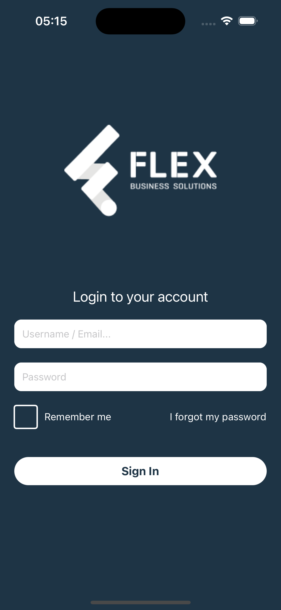
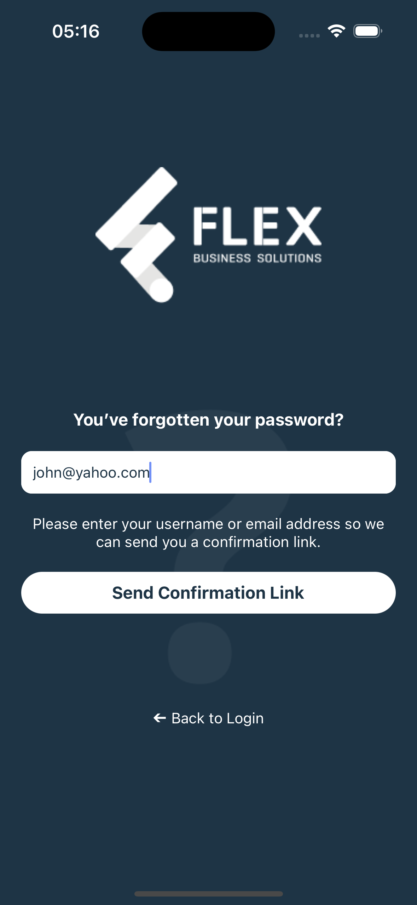
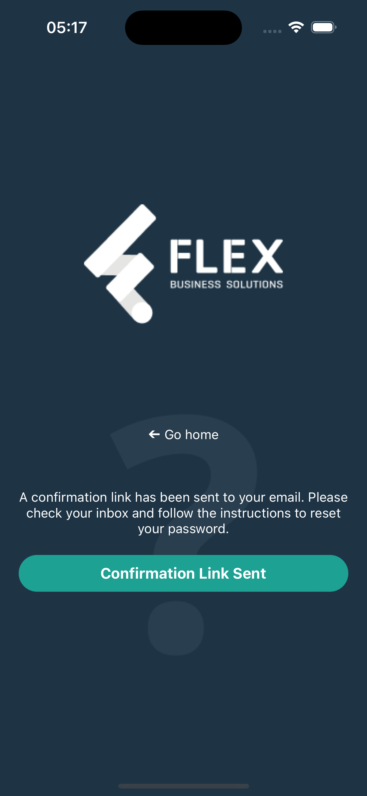
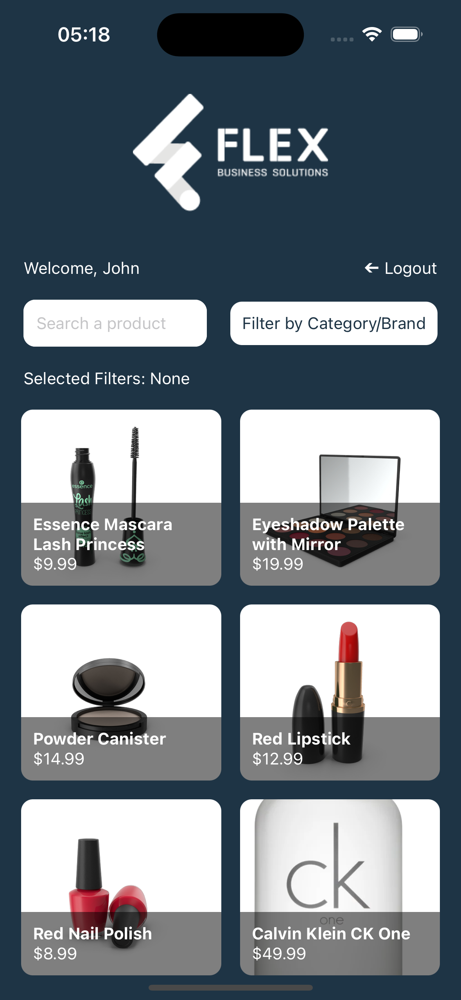
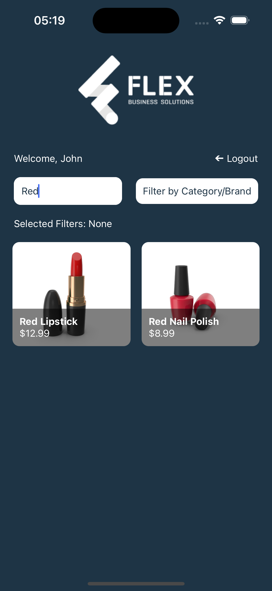
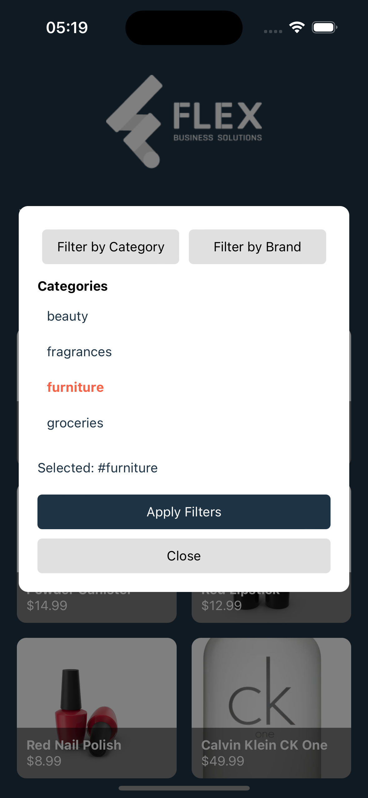
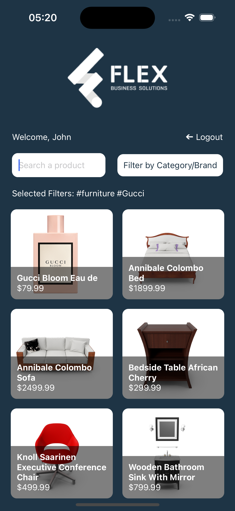

# Flex Business Solutions - Shopping App

This is a new [**React Native**](https://reactnative.dev) project, bootstrapped using [`@react-native-community/cli`](https://github.com/react-native-community/cli).

## Introduction

Welcome to the Flex Business Solutions Shopping App! This application is designed to provide a seamless shopping experience, allowing users to browse products, filter by categories, and manage their shopping lists. 

### Preview

#### Image Previews:

<p align="center">
  
  
  
</p>
<p align="center">
  
  
  
  
</p>

#### Video Preview:

<video src='assets/preview/rec.mp4' />
---

## Tech Stack

This app leverages a comprehensive set of modern technologies to deliver a high-performance and responsive shopping experience:

- **React Native (v0.75.4)**: The core framework for building cross-platform mobile apps for iOS and Android using a single codebase.
  
- **Redux Toolkit**: Used for managing global state in the app. It simplifies the logic around state management and helps in maintaining a predictable state architecture.

- **React Navigation**: Provides seamless navigation between different screens, allowing users to switch between pages like the product listing and detailed views.

- **Axios**: Handles API requests efficiently, enabling smooth and fast communication with external services for product data and other resources.

- **React Native Reanimated**: A powerful animation library that enables smooth, fluid UI animations throughout the app, enhancing the overall user experience.

- **React Native Gesture Handler**: Improves gesture handling, making swipe, touch, and drag actions highly responsive and reliable, especially on mobile platforms.

- **TypeScript**: Ensures the application code is strongly typed, which improves developer productivity and reduces bugs, leading to more maintainable and scalable code.

- **Async Storage**: Used for persisting small amounts of data locally on the device, ensuring app state is stored between sessions.

---

## Getting Started

>**Note**: Make sure you have completed the [React Native - Environment Setup](https://reactnative.dev/docs/environment-setup) instructions till the "Creating a new application" step before proceeding.

### Step 1: Start the Metro Server

First, you will need to start **Metro**, the JavaScript _bundler_ that ships _with_ React Native.

To start Metro, run the following command from the _root_ of your React Native project:

```bash
# using npm
npm start

# OR using Yarn
yarn start
